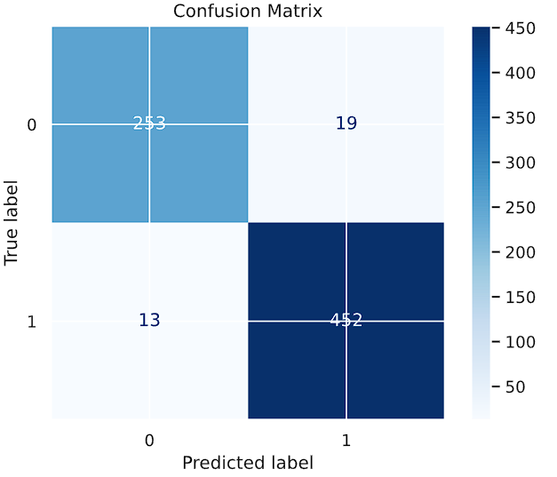
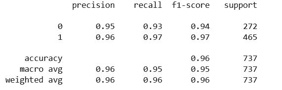
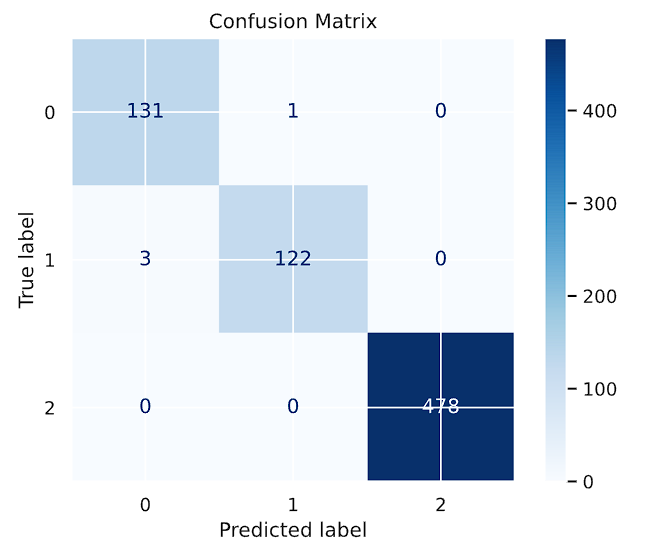
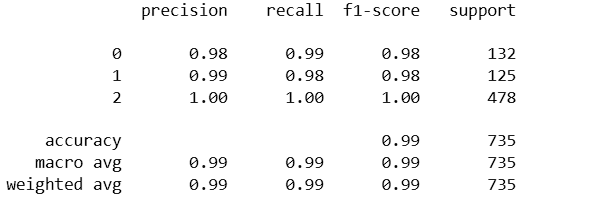

# 🧠 Brain MRI Classification via SimCLR & Cosine MLP

This project explores **contrastive pretraining and feature-based transfer learning** for brain MRI classification. By leveraging **SimCLR** for unsupervised feature extraction, we enable **flexible and efficient downstream classification** across multiple neurological conditions including **tumors and strokes**.

---

## Why SimCLR?

Instead of training a model from scratch or fine-tuning a heavyweight transformer like **Facebook's DeiT**, we use **SimCLR** to learn general-purpose brain scan features from unlabeled data.

- **Once trained**, the SimCLR encoder acts as a **universal feature extractor**
- These embeddings can then be used for **any downstream task**:
  - Tumor detection
  - Stroke diagnosis
 
- ⚡ This approach is **parameter-efficient** and **much faster to train** than end-to-end supervised models

---

## 🧬 Datasets Used

We merged several publicly available brain MRI datasets:

- 🧠 [`youngp5/BrainMRI`](https://huggingface.co/datasets/youngp5/BrainMRI)
- 🧠 [`Mahadih534/brain-tumor-MRI-dataset`](https://huggingface.co/datasets/Mahadih534/brain-tumor-MRI-dataset)
- 🧠 [`Falah/Alzheimer_MRI`](https://huggingface.co/datasets/Falah/Alzheimer_MRI) (train/test)
- 🧠 [`BTX24/tekno21-brain-stroke-dataset-binary`](https://huggingface.co/datasets/BTX24/tekno21-brain-stroke-dataset-binary)

All images were resized, normalized, and converted to grayscale, then augmented for SimCLR pretraining.

---

## Data Augmentations

We applied the following augmentations during SimCLR training to learn robust, structure-aware embeddings:

- `RandomResizedCrop`
- `GaussianBlur`
- `Grayscale`
- `RandomHorizontalFlip`
- `Normalize(mean=0.5, std=0.5)`

---

## Cosine MLP Classifier

After pretraining, we froze the SimCLR encoder and trained a **Cosine MLP Classifier** on top of the 512-dim features.
Instead of a standard linear head, we use a Cosine MLP Classifier, which computes classification scores based on cosine similarity between normalized embeddings and class weights.

## Results
Despite training only the lightweight MLP head, we achieved strong performance across all tasks — matching or outperforming deeper fine-tuned models like DeiT with significantly fewer parameters and compute.

### Stroke Classification
<table> <tr> <td><strong>Confusion Matrix</strong></td> <td><strong>Classification Report</strong></td> </tr> <tr> <td></td> <td></td> </tr> </table>

### Tumor Detection
<table> <tr> <td><strong>Confusion Matrix</strong></td> <td><strong>Classification Report</strong></td> </tr> <tr> <td></td> <td></td> </tr> </table>

